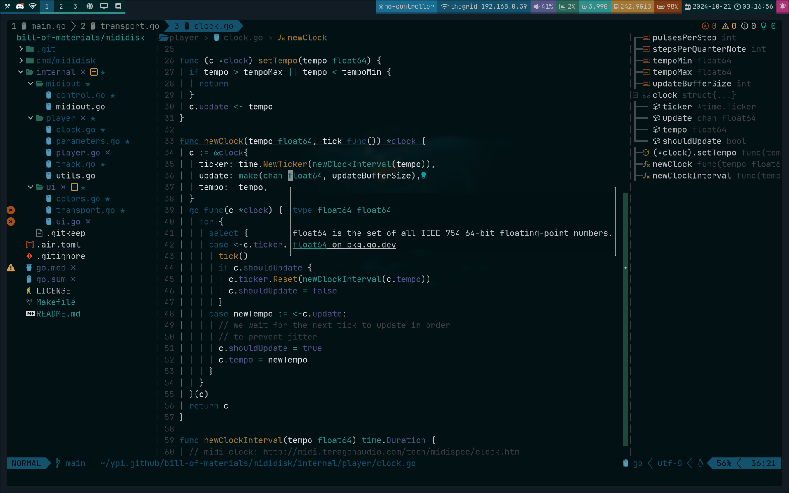
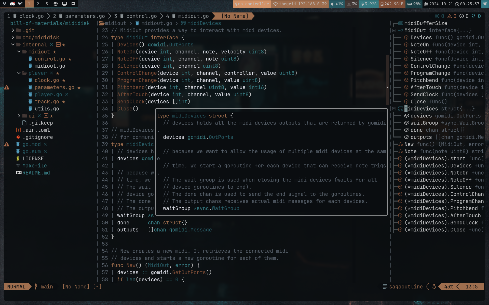
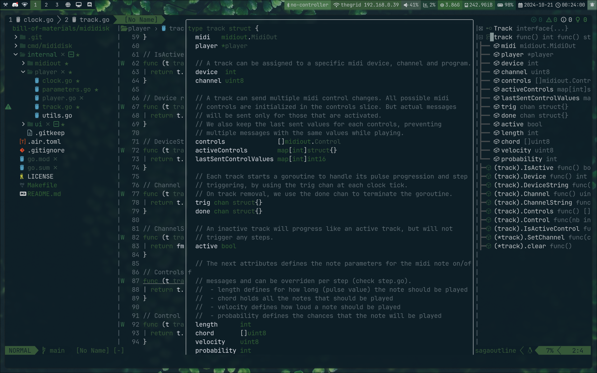

# pywal16.nvim

Pywal16.nvim is a modification of
[pywal.nvim](https://github.com/AlphaTechnolog/pywal.nvim), aiming to support
a transparent background, 16 colors palettes, and more plugins.

It is made to work with [pywal16](https://github.com/eylles/pywal16),
which is a fork of pywal generating/supporting 16 colors colorschemes (original
pywal project only supports 9 colors).

| pywal version | editor | colorscheme |
| --------------|--------|------------ |
| [dylanaraps/pywal](https://github.com/dylanaraps/pywal) (archived) | vim | [dylanaraps/wal.vim](https://github.com/dylanaraps/wal.vim) (archived) |
| [dylanaraps/pywal](https://github.com/dylanaraps/pywal) (archived) | neovim | [AlphaTechnolog/pywal.nvim](https://github.com/AlphaTechnolog/pywal.nvim) (archived) <br> [oncomouse/Lushwal.nvim](https://github.com/oncomouse/lushwal.nvim) <br> [sonjiku/yawnc.nvim](https://github.com/sonjiku/yawnc.nvim) <br> [RedsXDD/neopywal.nvim](https://github.com/RedsXDD/neopywal.nvim) <br> ... |
| [eylles/pywal16](https://github.com/eylles/pywal16) | vim | ? |
| [eylles/pywal16](https://github.com/eylles/pywal16) | neovim | [uZer/pywal16.nvim](https://github.com/uZer/pywal16.nvim) ◄ (you are here!) |

This colorscheme is compatible with "classic" 16 colors palettes (solarized,
molokai, base16, etc.), and has been made to preserve the "red", "green" and
"yellow" implicit meanings. Please note that the presaved themes bundled in
pywal16 or pywal don't all take profit of the 16 colors. You can find some extra
colorschemes in my
[dotfiles repository](https://github.com/uZer/.minimics/tree/master/pywal16themes).

Pywal.nvim was a reimplementation of
[pywal.vim](https://github.com/dylanaraps/wal.vim) totally written in lua, with
extra plugin support. Lua is a better choice if you use plugins also written in
lua like Telescope or NvimTree that aren't supported by default in wal.vim.

This plugin takes advantage of termguicolors (which was unsupported by wal.vim)
and won't use/declare any `ctermbg` or `ctermfg`.

<!--toc:start-->
- [pywal16.nvim](#pywal16nvim)
  - [Screenshots](#screenshots)
  - [Plugin Support](#plugin-support)
  - [Installation](#installation)
  - [Active theme](#active-theme)
  - [Enable lualine theme](#enable-lualine-theme)
  - [Enable the feline theme (untested with pywal16, I don't use feline)](#enable-the-feline-theme-untested-with-pywal16-i-dont-use-feline)
  - [Using the core to get the colors](#using-the-core-to-get-the-colors)
  - [How it works](#how-it-works)
  - [Hack me](#hack-me)
  - [Thanks](#thanks)
  - [Enjoy](#enjoy)
<!--toc:end-->

## Screenshots

*using a [custom pywal16
colorscheme](https://github.com/uZer/.minimics/blob/master/pywal16/colorschemes/dark/sw16-sixteal-soft-darker.json)
with 16 different colors, preserving red, yellow and green for error, warn,
etc.*


*using wallpaper generated themes*



## Plugin Support

- NeoVim (checkhealth...)
- BetterWhitespace
- BufferLine
- Coc
- Diff
- Feline
- GitGutter
- GitSigns
- Indent-BlankLine
- Illuminate
- LSP
- LspSaga
- LspTrouble
- Lualine
- Neogit
- NvimTree
- nvim-navic
- Nvim-scrollbar
- Telescope
- Tree-sitter

## Installation

You can install this plugin with packer:

```lua
use { 'uZer/pywal16.nvim', as = 'pywal16' }
```

With lazy:
```lua
{
  'uZer/pywal16.nvim',
  -- for local dev replace with:
  -- dir = '~/your/path/pywal16.nvim',
  config = function()
    vim.cmd.colorscheme("pywal16")
  end,
}
```

With vim-plug:

```vim
Plug 'uZer/pywal16.nvim', { 'as': 'pywal16' }
```

## Active theme

To enable the theme, call this in your neovim config:

```lua
local pywal16 = require('pywal16')

pywal16.setup()
```

Or with vim script:

```vim
colorscheme pywal16
```

> It will set automatically the `vim.opt.termguicolors` to true

## Enable lualine theme

Place this in your lualine config:

```lua
local lualine = require('lualine')

lualine.setup {
  options = {
    theme = 'pywal16-nvim',
  },
}
```

## Enable the feline theme (untested with pywal16, I don't use feline)

You can put this to your config to activate the feline config:

```lua
local present, feline = pcall(require, 'feline')

if not present then
  return
end

local present, pywal16_feline = pcall(require, 'pywal16.feline')

if not present then
  return
end

feline.setup({
  components = pywal16_feline,
})
```

Then you should see the feline bar working successfully.

## Using the core to get the colors

If you want to get the colors into a lua dictionary:

```lua
local pywal16_core = require('pywal16.core')
local colors = pywal16_core.get_colors()
```

## How it works

pywal/pywal16 automatically generate a file called `colors-wal.vim` in
`~/.cache/wal/colors-wal.vim`, it file contains all the colors that are necesary
to works for vim, it files looks like this:

```vim
" Special
let wallpaper  = "/home/user/Pictures/winter-purple.jpg"
let background = "#110914"
let foreground = "#e3cfe2"
let cursor     = "#e3cfe2"

" Colors
let color0  = "#110914"
let color1  = "#A378B6"
let color2  = "#B687AD"
let color3  = "#D9A2AF"
let color4  = "#F8DDAD"
let color5  = "#AD90CF"
let color6  = "#D2ACD6"
let color7  = "#e3cfe2"
let color8  = "#9e909e"
let color9  = "#A378B6"
let color10 = "#B687AD"
let color11 = "#D9A2AF"
let color12 = "#F8DDAD"
let color13 = "#AD90CF"
let color14 = "#D2ACD6"
let color15 = "#e3cfe2"
```

The theme only reads it files variables and then create a colors dictionary to
create a theme based in it's colors

## Hack me

Feel free to modify anything you want in this theme on your own fork, or to open
PR if you want to add and/or change some features on this one. I changed most of
the initial colors, added some plugin support and highlights, but mostly didn't
touch the original files.

## Thanks

[dylanaraps](https://github.com/dylanaraps) (pywal)

[eylles](https://github.com/eylles) (pywal16)

[AlphaTechnolog](https://github.com/AlphaTechnolog) (original pywal.nvim)

Contributors

## Enjoy

If you like this work you can give it a star :)
